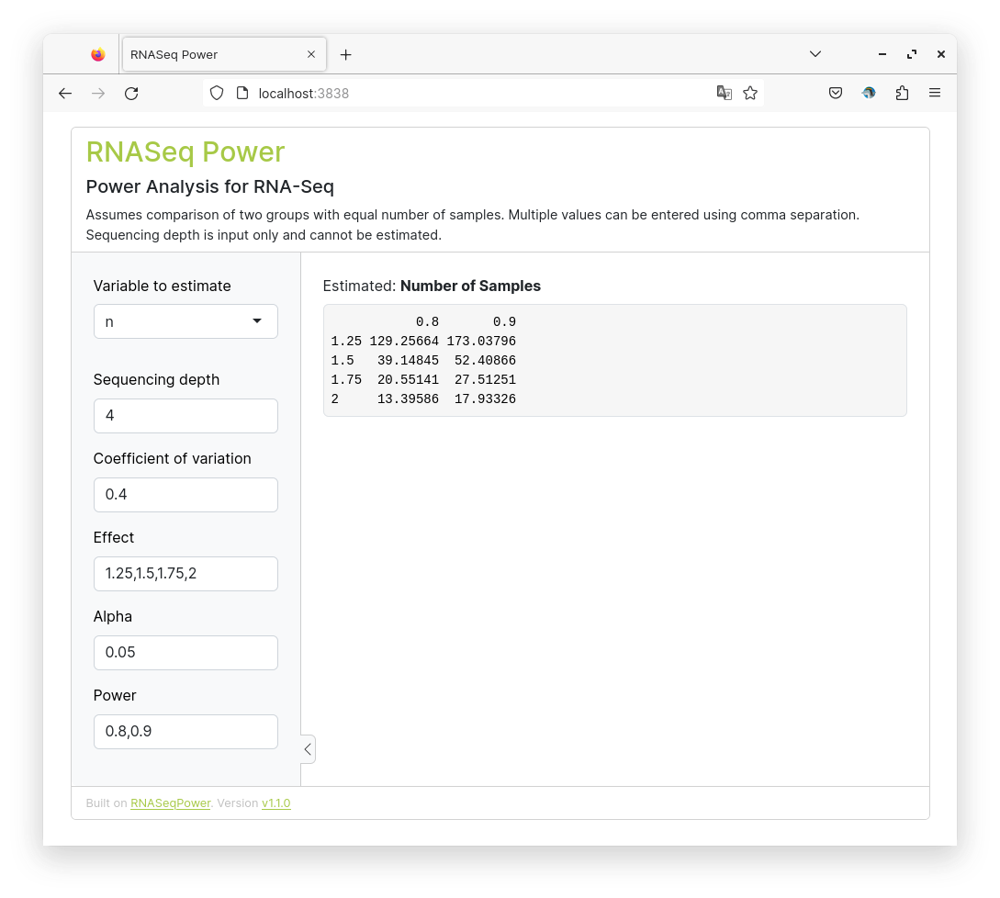

# shiny-rnaseq-power

[](https://github.com/royfrancis/shiny-rnaseq-power/actions?workflow=build) [](https://hub.docker.com/repository/docker/royfrancis/shiny-rnaseq-power)

This is an R shiny app to run power analysis for RNA-Seq experiments.



## Running the app

### Run online

Click [here](https://roymf.shinyapps.io/rnaseq-power/) to access an online instance of this app. This link may not always be active.

### Run using docker

```
docker run --rm -p 8787:8787 royfrancis/shiny-rnaseq-power:v1.0.0
```

The app should be available through a web browser at `http://0.0.0.0:8787`.

### Run in R

Install the following R packages:

```
install.packages(c("Bioconductor", "shiny", "shinyBS", "shinythemes"))
BiocManager::install("RNASeqPower")
```

This repo is not an R package. Clone this repo and execute the R command `shiny::runApp("app.R")` in the root directory.

2021 • Roy Francis
